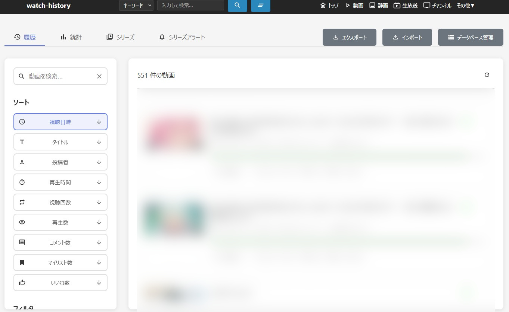
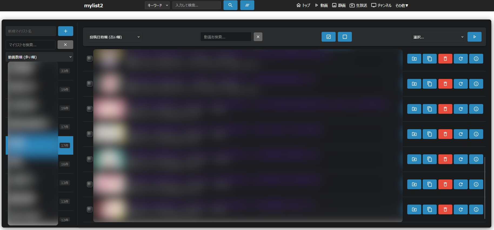
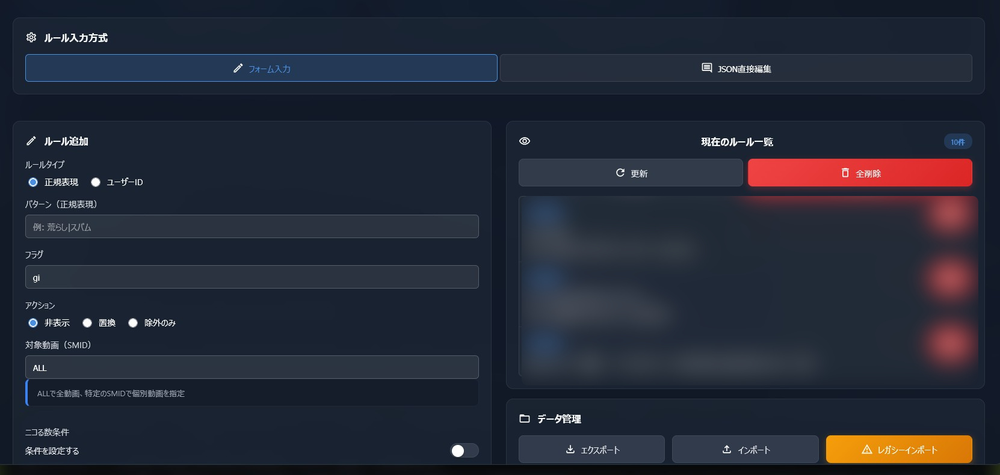
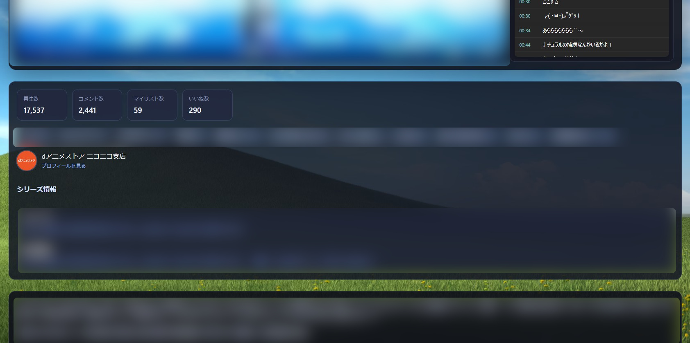
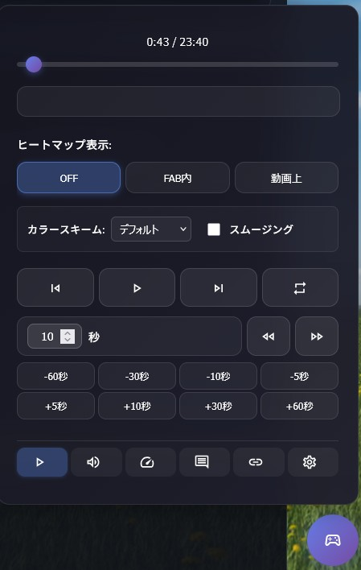

# filter-matome

[](https://opensource.org/licenses/MIT)
[](https://github.com/roflsunriz/filter-matome/releases)
[](https://github.com/roflsunriz/filter-matome/releases/latest)

**filter-matome**は、ニコニコ動画の視聴体験を大幅に向上させる高機能な拡張機能群です。視聴履歴の無制限保存、強力なコメントフィルター、マイリスト2、動画プレイヤー拡張など、多彩な機能を提供します。

## 機能プレビュー

### watch-hisotry

### mylist2

### comment-filter2

### video-player

### mlink-video-controller


## ✨ 主な機能

### 🎯 コア機能
- **視聴履歴**: ブラウザ容量の許す限り無制限で履歴を保存・統計表示、シリーズ追跡、検索・フィルタ
- **マイリスト2**: 複数マイリスト作成、検索、ソート、一括操作、検索ワード保存
- **コメントフィルター2**: 公式NGワードを遥かに凌ぐ強力なフィルタリング機能、NGユーザー・ニコる数設定、コメントコマンド設定、フィルターログ送信
- **動画プレイヤー拡張**: 有料動画キャッシュ再生、削除済み動画検知・再生、HLS対応、同期機能
- **マルチリンクビデオコントローラー**: 再生速度調整、フレーム単位シーク、音量微調整、コメントヒートマップ、モジュール管理

### 🛠️ 拡張機能
- **背景画像設定**: 視聴ページの背景をカスタマイズ
- **プレミアム勧誘非表示**: 煩わしい勧誘要素を完全除去
- **コメントヒートマップ**: 盛り上がり箇所を視覚化

## 📦 導入方法

### 前提条件
- [NicoCache_nl](https://w.atwiki.jp/nicocachenlwiki/) 本体のインストール
- [Adoptium Temurin OpenJDK 17 LTS 17.0.17+10](https://adoptium.net/temurin/releases?version=17&os=any&arch=any) 以上 又は [Adoptium Temurin OpenJDK 21 LTS 21.0.9+10-LTS](https://adoptium.net/temurin/releases?version=21&os=any&arch=any) 以上
- [Apache Ant 1.10.15](https://ant.apache.org/bindownload.cgi) 以上
- [Boucy Castle 1.8.3](https://www.bouncycastle.org/download/bouncy-castle-java/#latest) 以上 (PKIX/CMS/EAC/PKCS/OCSP/TSP/OPENSSL(bcpkix), Provider(bcprov), ASN.1 Utility Classes(bcutil))
- 対応ブラウザ: [Firefox 147](https://www.firefox.com/ja/download/all/desktop-release/) 以上(推奨), [Chrome 144.0.7559.59/60](https://www.google.com/chrome/other-platforms/) 以上

### インストール手順

1. **NicoCache_nl本体の導入**
   ```bash
   # NicoCache_nl Wikiを参照してインストール
   ```
   [インストール方法](https://w.atwiki.jp/nicocachenlwiki/pages/30.html)

2. **フィルター群の配置**
   ```bash
   # ディレクトリ構造を維持して以下に配置
   NicoCache_nl/
   ├── nlFilters/     # 100-199番台のDSLフィルター
   ├── local/         # 拡張機能のコンパイル済みファイル、ソースコード
   └── extensions/    # 追加拡張機能のコンパイル済みファイル、ソースコード
   ```

3. **設定の有効化**
   - NicoCache_nlを起動
   - ブラウザでハード再読み込み（Ctrl+F5）

### クリーンインストール
```bash
# 既存の100-199番台フィルターを削除
# extensions,local,nlFiltersにあるファイルをダウンロードファイルを見ながら削除(必要なファイルを間違えて消さないため)
# 新しいファイルで上書き更新
# 設定のインポート（必要に応じて）
```

## 📖 機能詳細

### 視聴履歴 (watch-history)
- **無制限履歴保存**: ニコニコ動画の50件制限を突破
- **高度な統計**: 日別視聴状況・時間帯別視聴状況
- **シリーズ追跡**: 新規投稿の自動通知・シリーズナビゲーション
- **検索・フィルタ**: 強力な検索・ソート機能
- **メモ機能**: 履歴にメモを残せる
- **インポート/エクスポート**: データの移行・バックアップ

### マイリスト2 (mylist2)
- **複数マイリスト**: 無制限でマイリスト作成
- **高度な管理**: 検索、ソート、一括操作
- **インポート/エクスポート**: データの移行・バックアップ
- **API連携**: 自動情報取得・更新
- **一括移動・コピー・削除・更新**: 一括操作
- **検索ワード保存**: 検索ワードの保存

### コメントフィルター2 (comment-filter2)
- **JSON Lines形式**: 高度なルール設定
- **エクスポート・インポート**: データの移行・バックアップ
- **正規表現対応**: 柔軟なパターンマッチング
- **リアルタイム処理**: 高速なコメント処理
- **NGユーザー・ニコる数設定**: NGユーザー設定によるフィルタリング・ニコる数による除外・含める設定
- **コメントコマンド設定**: "big"や"shita"や"red"などのコメントコマンドの設定
- **フィルターログ送信**: CommentFilterExtensionへのフィルターログの送信

### 動画プレイヤー拡張 (video-player)
- **期限切れ動画再生**: キャッシュを活用した視聴継続
- **削除済み動画対応**: キャッシュが存在するが削除されてしまった動画の視聴
- **HLS対応**: 最新のニコニコ動画仕様の対応
- **同期機能**: コメントと動画の完全同期
- **NGワード・NG正規表現**: コメントのNGワード・NG正規表現

### マルチリンクビデオコントローラー (mlink-video-controller)
- **リンク提供**: mylist2, comment-filter2, watch-history, mylist2への追加ボタン、動画非表示設定、ニコニコ動画関連サービスへのリンク、キャッシュリスト、キャッシュ情報、nlMediaInfo, 音声保存、動画保存、コメント保存、キャッシュ削除
- **再生速度調整**: 再生速度の調整
- **多彩なコントロールボタン**: 再生・一時停止・次の動画・前の動画・繰り返し再生・シークバー・5秒スキップ・10秒スキップ・30秒スキップ・60秒スキップ
- **コメント検索**: コメントの検索
- **フレーム単位シーク**: フレーム単位でのシーク
- **音量微調整**: 音量の微調整
- **コメントヒートマップ**: コメントの盛り上がり箇所を視覚化
- **モジュール管理**: プライバシーモジュール、UI強化モジュール、視聴ページ機能強化モジュール、背景セレクタモジュール、マトリックス風背景モジュール


## 🔧 開発者向け情報

### 技術スタック
- **言語**: TypeScript 5.9.3
- **ビルドツール**: Vite 7.2.6
- **ストレージ**: IndexedDB
- **UI**: Material Design Icons
- **フィルター言語**: nlFilter (NicoCache_nl独自DSL)

### プロジェクト構成
```
local/
├─ background-images/    # 視聴ページ用の背景画像
├──images/               # ドキュメント用画像、フォールバックサムネイル
└─┬── features/          # メイン機能群
  ├── src/               # TypeScriptソースコード
  ├── dist/              # ビルド済みファイル
  └── config/            # Vite設定ファイル群

nlFilters/
├──resources/                       # 199_readme.htmlの画像, js, css
├── 100_common.txt                  # 共通ライブラリ(トースト通知、ロギング、共通ヘッダ、マテリアルアイコンヘルパなどを提供する共通ライブラリ)
├── 101_disable_official.txt        # 公式機能無効化(公式プレーヤーの再生速度調整を無効化)
├── 102_mlink_video_controller.txt  # マルチリンクビデオコントローラー(視聴ページにマルチリンクビデオコントローラーを追加)
├── 103_comment_filter2.txt         # コメントフィルター(視聴ページにコメントフィルターを追加)
├── 104_video_player.txt            # 動画プレイヤー(視聴ページに動画プレイヤーを追加)
├── 105_premium_hide.txt            # プレミアム勧誘非表示(ニコニコ動画共通コモンヘッダーのプレミアム勧誘を非表示)
├── 106_watch_history.txt           # 視聴履歴(視聴ページにウォッチトラッカーを追加)
├── 198_release_notes.*             # リリースノート
└── 199_readme.html                 # 詳細ドキュメント
```

### ビルド方法
```bash
cd local/features
npm install
npm run build

# 個別ビルド(詳細はpackage.jsonを参照)
npm run build:comment-filter2
```

### nlFilter文法
```ini
[Replace]
Name = フィルター名
URL = 対象URL正規表現
Match<
置換対象テキスト
>
Replace<
置換後テキスト
>

[Script]
Name = スクリプト名
URL = 対象URL正規表現
Append<
挿入するJavaScriptコード
>

[Style]
Name = スタイル名
URL = 対象URL正規表現
Append<
追加するCSSコード
>
```

## 📚 ドキュメント

- **詳細機能説明**: [nlFilters/199_readme.html](nlFilters/199_readme.html)
- **リリースノート**: [nlFilters/198_release_notes.md](nlFilters/198_release_notes.md)
- **編集ガイド**: [nlFilters/nlFilters_編集ガイド.md](nlFilters/nlFilters_編集ガイド.md)
- **Issue/Feature Requestの作り方**: [how-to-make-an-issue.md](how-to-make-an-issue.md)
- **シンボリックリンク作成手順 (必須)**: [creating-symlink-for-listjs.md](creating-symlink-for-listjs.md)
- シンボリックリンクはNicoCache_nlのキャッシュマネージャを使用する際に必須です。
- **機能別ドキュメント**:(インストール後に表示可能になります)
  - [Comment Filter2 説明](https://www.nicovideo.jp/local/features/dist/src/docs/comment-filter2/index.html)
  - [Mylist2 説明](https://www.nicovideo.jp/local/features/dist/src/docs/mylist2/index.html)


## ⚠️ 重要な注意事項

### シンボリックリンク作成（必須）
NicoCache_nl はキャッシュデータマネージャを `C:\NicoCache_nl\local\list.js` という固定パス・固定名で参照します。ビルド成果物（例: `cacheDataManager.iife.js`）へこの固定パス名でシンボリックリンクを作成しないと機能しません。詳細手順は [creating-symlink-for-listjs.md](creating-symlink-for-listjs.md) を参照してください。

### 使用上の注意
- **全機能同時使用前提**: 個別機能の抜き出しは動作保証外
- **データバックアップ**: ブラウザデータ削除前に必ずエクスポート実行
- **更新時の確認**: リリースノートを必ず確認してから更新
- **ハード再読み込み**: 機能の有効/無効切り替え後はCtrl+F5実行

### データ削除リスク
以下の操作でIndexedDBとローカルストレージの設定が消去されます：
- サイトデータの削除
- Cookieとサイトデータの削除
- オフライン作業用データの削除
- ブラウザデータの削除

**注意**: mylist2やcomment-filter2,watch-historyのデータはIndexedDBに保存されているので必ずエクスポートして安全な場所に退避してください！


## 🔗 関連リンク

### コミュニティ
- [NicoCache_nl Wiki](https://w.atwiki.jp/nicocachenlwiki/)
- [5ちゃんねる 本スレッド](https://find.5ch.net/search?q=NicoCache)
- [Talk スレッド](https://talk.jp/boards/software/1675038388)
- [おーぷん2ちゃんねる スレッド](https://ana.open2ch.net/test/read.cgi/software/1675001508/)
- [LibreJP 開発スレッド](https://sportschan.org/librejp/thread/16592.html)

### 開発ツール
- [Node.js](https://nodejs.org/ja/download)
- [Docker Desktop](https://www.docker.com/products/docker-desktop/)
- [Apache Ant](https://ant.apache.org/bindownload.cgi)
- [Adoptium OpenJDK](https://adoptium.net/temurin/releases/?version=17)
- [Bouncy Castle](https://www.bouncycastle.org/download/bouncy-castle-java/#latest)
- [Python](https://www.python.org/downloads/)
- [Powershell](https://learn.microsoft.com/ja-jp/powershell/scripting/install/installing-powershell-on-windows?view=powershell-7.5#msi)
- [WinMerge](https://winmerge.org/?lang=ja)
- [MediaInfo CLI](https://mediaarea.net/ja/MediaInfo/Download/Windows)

## 📄 ライセンス

MIT License - Copyright (c) 2017-2026 ◆awd5z.AlOFJq(roflsunriz)

私の名前を明記している限り、本ソフトウェアは自由に使用、複製、改変、配布、商用利用、非商用利用できます。詳細は[LICENSE](LICENSE)ファイルをご覧ください。

## 🚀 リリース情報

### 最新バージョン

- **リリース形式**: `#300`, `#301` などの番号形式
- **リリース履歴**: [nlFilters/198_release_notes.md](nlFilters/198_release_notes.md)

### リリース作成方法（開発者向け）
```bash
# 次のバージョンタグを作成してプッシュ
git tag "#300"
git push origin "#300"
```

```bash
# 間違えてリリースを作った場合、タグを削除して再度リリースを作成
git tag -d "#300"
git push origin :refs/tags/#300
```

## 🤝 コントリビューション

プルリクエストや課題報告を歓迎します。大きな変更を行う前に、まずIssueを作成して議論することをお勧めします。

## 🙏 謝辞

このプロジェクトは多くのコミュニティメンバーの協力により成り立っています。特に、フィードバックやバグレポートを提供してくださった全ての方々に感謝いたします。

---

**⚡ 高速・高機能・高カスタマイズ性 - filter-matomeでニコニコ動画を最大限に活用しましょう！**
