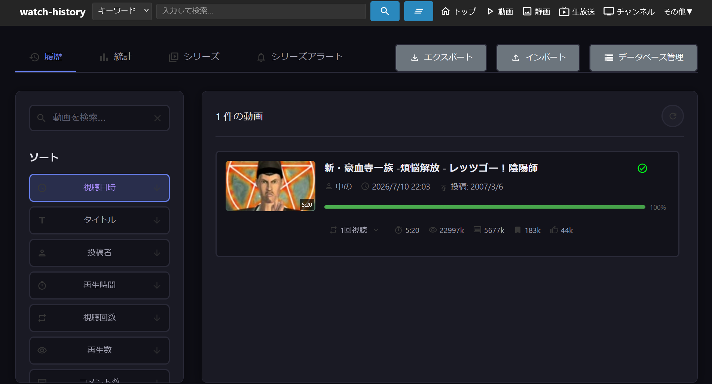
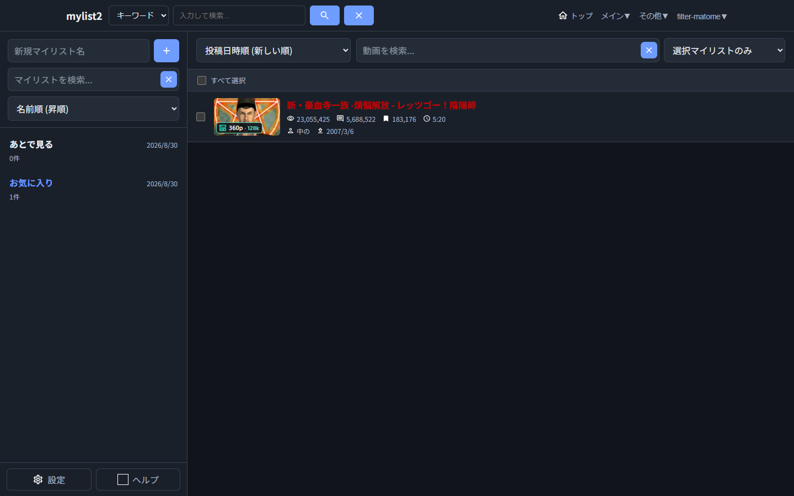
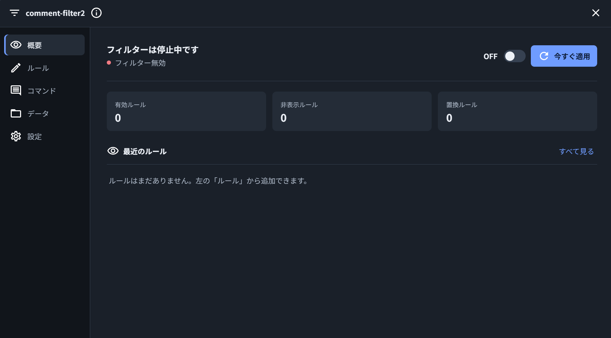
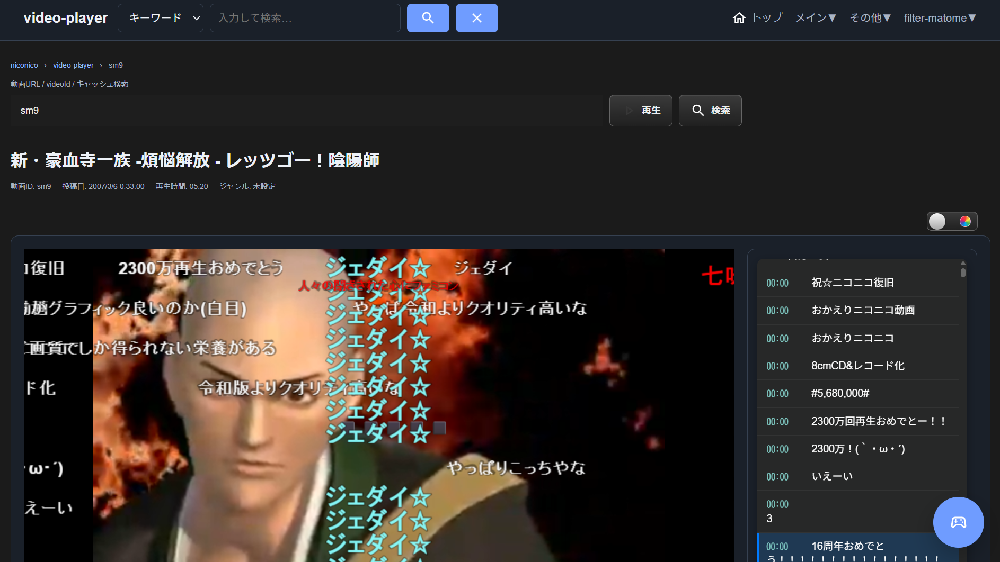
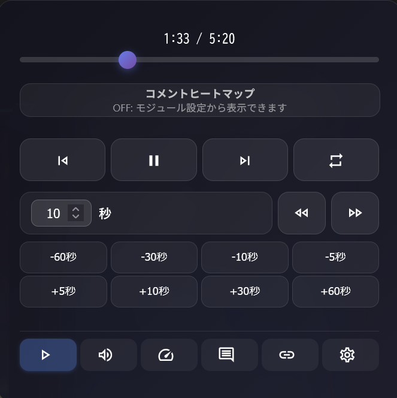

# filter-matome

[](https://opensource.org/licenses/MIT)
[](https://github.com/roflsunriz/filter-matome/releases)
[](https://github.com/roflsunriz/filter-matome/releases/latest)

**filter-matome**は、ニコニコ動画の視聴体験を大幅に向上させる高機能な拡張機能群です。視聴履歴の無制限保存、強力なコメントフィルター、マイリスト2、動画プレイヤー拡張など、多彩な機能を提供します。

## 機能プレビュー

### watch-history

### mylist2

### comment-filter2

### video-player

### mlink-video-controller


## ✨ 主な機能

### 🎯 コア機能
- **視聴履歴**: ブラウザ容量の許す限り無制限で履歴を保存・統計表示、シリーズ追跡、検索・フィルタ、キャッシュ品質アイコン表示
- **マイリスト2**: 複数マイリスト作成、検索、ソート、一括操作、検索ワード保存、キャッシュ品質アイコン表示
- **コメントフィルター2**: 公式NGワードを遥かに凌ぐ強力なフィルタリング機能、ページ再読み込み不要の再適用、描画コメントの右クリックからコピー・検索・URL表示・NG追加、NGユーザー・ニコる数設定、コメントコマンド設定、フィルターログ送信
- **動画プレイヤー拡張**: 有料動画キャッシュ再生、削除済み・視聴不可動画のローカル再生、HLS対応、コメント描画・同期機能、ウォッチページ取得失敗時のnicochart.jp動画情報フォールバック
- **マルチリンクビデオコントローラー**: 再生速度調整、フレーム単位シーク、音量微調整、コメントヒートマップ、サムネイルフィルター、原宿風Watch表示、モジュール管理

### 🛠️ 拡張機能
- **背景画像設定**: 視聴ページの背景をカスタマイズ
- **プレミアム勧誘非表示**: 煩わしい勧誘要素を完全除去
- **コメントヒートマップ**: 盛り上がり箇所を視覚化
- **動画/API情報ダッシュボード**: 動画IDから複数APIの情報を横断表示
- **動画取得スケジューラー**: 動画・日時・確認の3段階ウィザードで予約し、繰り返し、祝日、モード別の帯域上限、完了可能時間の判定、再試行、個別・一括削除できる取得履歴を管理

## 📦 導入方法

### 前提条件
- [NicoCache_nl](https://roflsunriz.github.io/setup-nicocache-nl/) 本体のインストール
- [Adoptium Temurin OpenJDK 25 LTS](https://adoptium.net/temurin/releases?version=25&os=any&arch=any)
```powershell
winget install EclipseAdoptium.Temurin.25.JDK
```
- 対応ブラウザ: [Firefox](https://www.firefox.com/ja/download/all/desktop-release/)(推奨)
```powershell
winget install Mozilla.Firefox.ja
```
- または [Chrome](https://www.google.com/chrome/other-platforms/)
```powershell
winget install Google.Chrome
```

リリースアーカイブには、matome-toolboxのビルド済みJARも
`scripts/matome-toolbox/target/matome-toolbox-0.1.0-SNAPSHOT.jar` として同梱しています。通常利用ではMaven、Bun、Apache Antのビルド手順は不要です。NicoCache_nl本体の導入に必要なBouncy Castleなどの要件は、NicoCache_nl側の案内に従ってください。

### インストール手順

- リリースアーカイブのルートには `GUIDE.html` を同梱しています。`USAGE GUIDE` と `NicoCache_nl SETUP GUIDE` への入口として使えます。

1. **NicoCache_nl本体の導入**
   ```bash
   # NicoCache_nl Usage Guideを参照してインストール
   ```
   [インストール方法](https://roflsunriz.github.io/setup-nicocache-nl/install-win/)

2. **フィルター群の配置**
   ```bash
   # ディレクトリ構造を維持して以下に配置
   NicoCache_nl/
   ├── nlFilters/     # 100-105番台のDSLフィルター
   ├── local/         # TypeScript系拡張機能のコンパイル済みファイル、ソースコード
   └── extensions/    # Java系拡張機能のコンパイル済みファイル、ソースコード
   ```

3. **設定の有効化**
   - NicoCache_nlを起動
   - ブラウザでハード再読み込み（Ctrl+F5を同時押し）

4. **matome-toolboxの利用（必要な場合）**
   ```powershell
   java -jar C:\NicoCache_nl\scripts\matome-toolbox\target\matome-toolbox-0.1.0-SNAPSHOT.jar --list-plugins
   ```
   GUIは引数なし、サーバーや自動処理では`--headless`を付けて起動できます。使える機能と操作例は[`scripts/README.matome-toolbox.md`](scripts/README.matome-toolbox.md)を参照してください。

### クリーンインストール
[USAGE](https://roflsunriz.github.io/filter-matome/USAGE/) のクリーンインストール手順を参照

## 📖 機能詳細

### 視聴履歴 (watch-history)
- **無制限履歴保存**: ニコニコ動画の50件制限を突破
- **高度な統計**: 日別視聴状況・時間帯別視聴状況
- **シリーズ追跡**: NicoCache_nl常駐extensionを正本とするアラート管理、ページ非表示時の新規投稿通知・シリーズナビゲーション
- **検索・フィルタ**: 強力な検索・ソート機能
- **メモ機能**: 履歴にメモを残せる
- **インポート/エクスポート**: データの移行・バックアップ

### マイリスト2 (mylist2)
- **複数マイリスト**: 無制限でマイリスト作成
- **高度な管理**: 検索、ソート、一括操作
- **インポート/エクスポート**: データの移行・バックアップ
- **API連携**: 自動情報取得・更新
- **一括移動・コピー・削除・更新**: 一括操作
- **検索ワード保存**: 検索ワードの保存

### コメントフィルター2 (comment-filter2)
- **JSON Lines形式**: 高度なルール設定
- **エクスポート・インポート**: データの移行・バックアップ
- **正規表現対応**: 柔軟なパターンマッチング
- **リアルタイム処理**: 高速なコメント処理
- **リロード不要の再適用**: 公式コメントだけを再取得し、視聴ページを維持したまま変更後のルールを反映
- **描画コメントの右クリック操作**: DOM探索に依存せず、コメントのコピー、Google検索、HTTP(S) URLの新規タブ表示、comment-filter2へのNGワード・NGユーザーID追加
- **NGユーザー・ニコる数設定**: NGユーザー設定によるフィルタリング、ニコる数条件による対象指定、条件一致コメントのフィルタ免除
- **コメントコマンド設定**: "big"や"shita"や"red"などのコメントコマンドの設定
- **フィルターログ送信**: CommentFilterExtensionへのフィルターログの送信

### 動画プレイヤー拡張 (video-player)
- **期限切れ動画再生**: キャッシュを活用した視聴継続
- **削除済み動画対応**: キャッシュが存在するが削除されてしまった動画の視聴
- **視聴不可動画対応**: ローカルキャッシュがある動画はスタンドアロンプレイヤーで再生
- **HLS対応**: 最新のニコニコ動画仕様の対応
- **同期機能**: コメントと動画の完全同期
- **NGワード・NG正規表現**: コメントのNGワード・NG正規表現

### マルチリンクビデオコントローラー (mlink-video-controller)
- **リンク提供**: mylist2, comment-filter2, watch-history, mylist2への追加ボタン、動画非表示設定、ニコニコ動画関連サービスへのリンク、キャッシュリスト、キャッシュ情報、nlGpac, 音声保存、動画保存、コメント保存、キャッシュ削除
- **再生速度調整**: 再生速度の調整
- **多彩なコントロールボタン**: 再生・一時停止・次の動画・前の動画・繰り返し再生・シークバー・5秒スキップ・10秒スキップ・30秒スキップ・60秒スキップ
- **コメント検索**: コメントの検索
- **フレーム単位シーク**: フレーム単位でのシーク
- **音量微調整**: 音量の微調整
- **コメントヒートマップ**: コメントの盛り上がり箇所を視覚化
- **サムネイルフィルター**: キーワード・正規表現で動画サムネイルを非表示
- **原宿風Watch表示**: 視聴ページの表示を原宿風レイアウトへ変更し、事前取得した動画説明文を内容量に応じて伸縮・最大高以降スクロールで表示
- **モジュール管理**: ヘッダープライバシー、UI強化、視聴ページ機能強化、背景セレクター/背景画像設定、マトリックス背景、タブセッション拡張などを管理

### 動画/API情報ダッシュボード (movie-info)
- **横断取得**: NicoCache_nl RESTキャッシュAPI、動画情報API、GPACメディア解析、watch apiDataを並列取得
- **GPAC仕様表示**: 再生時間、解像度、ビットレート、フレーム、色、音声、コンテナ情報、全ストリーム属性をmovie-infoで確認
- **コメント取得**: 必要時だけ全フォークコメントを取得し、プレビューとフルJSON保存を提供
- **エラー表示**: 一部API取得失敗時も成功したパネルを表示し、失敗元と確認ポイントを整理


## 🔧 開発者向け情報

### 技術スタック
- **言語**: TypeScript
- **ビルドツール・ランタイム**: Bun（要求バージョンは `local/features/package.json` を参照）
- **補助ツール**: Java 25、Maven（matome-toolboxの開発・テスト時のみ）
- **静的解析**: ESLint、typescript-eslint
- **テスト**: Bun test、Playwright
- **ストレージ**: IndexedDB
- **UI**: Material Design Icons
- **フィルター言語**: nlFilter (NicoCache_nl独自DSL)

### プロジェクト構成
```
local/
├─ background-images/    # 視聴ページ用の背景画像
└─┬── features/          # メイン機能群
  ├── src/               # TypeScriptソースコード
  │   ├── api-info/             # ニコニコ動画/API仕様メモ
  │   ├── comment-filter2/      # コメントフィルター
  │   ├── common/               # 共通ヘルパー、共通ヘッダー、ロガー、トースト
  │   ├── mlink-video-controller/ # 視聴ページ操作パネルとモジュール
  │   ├── movie-fetcher/        # 一覧カードからDomand/CMAFを取得
  │   ├── movie-info/           # 動画/API情報ダッシュボード
  │   ├── mylist2/              # マイリスト2
  │   ├── runtime/              # 配信ページ判定と起動境界
  │   ├── sandbox/              # 外部バンドルを隔離してAPI契約を調査する領域
  │   ├── types/                # 共通型定義
  │   ├── video-player/         # ローカル動画プレイヤー
  │   └── watch-history/        # 視聴履歴SPAと視聴追跡
  ├── tests/             # Bun単体テスト、Playwrightテスト、fixture
  ├── dist/              # Bunで生成した単一バンドル、Worker、静的HTML
  └── scripts/           # Bunビルド・テストスクリプト

nlFilters/
├── 100_features.txt                # 全機能を含むfeatures.jsをニコニコ動画全体へ挿入
├── 101_disable_official_function.txt # 公式機能無効化(公式プレーヤーの再生速度調整を無効化)
├── 102_comment_reload_api.txt       # 公式コメント再取得actionをcomment-filter2へ公開
├── 103_official_comment_menu.txt    # 公式Reactコメントメニューへcomment-filter2操作を接続
└── 105_premium_hide.txt            # プレミアム勧誘非表示(ニコニコ動画共通コモンヘッダーのプレミアム勧誘を非表示)

extensions/
├── CommentFilterLogger.java/.class       # コメントフィルターログの受信とGUI表示
├── ExtUtil.java/.class                   # Java拡張向けの共通ユーティリティ
├── FilterMatomeSeriesAlerts.java/.class # シリーズ新着の定期確認とOS通知
├── FilterMatomeSmartFetcher.java/.class # 永続予約・暗号化Cookie・帯域制御・取得履歴の管理
├── NicochartInfoProxy.java/.class        # 再生不可時のnicochart.jp動画情報フォールバック
├── nlGpac.java/.class                    # GPACによるローカルキャッシュのメディア解析API
└── nlMovieFetcher.java/.class            # 現行Domand/CMAF配信の取得・進捗確認・中止API

docs/resources/            # USAGE.mdで使われる画像リソース
```

### ビルド方法
```bash
cd local/features
bun install
bun run format
bun run lint
bun run type-check
bun run test
bun run build
```

CIと同じ検証をまとめて実行する場合は`bun run verify`を使用します。CI・リリースでは`bun install --frozen-lockfile`により`bun.lock`との差分を拒否します。

`features.js`はページ判定用の軽量ブートストラップで、必要な機能だけを`entries/`から遅延読み込みします。生成は単一の`bun run build`で一括して行います。
構成、生成物、プロジェクト別READMEは [`local/features/README.md`](local/features/README.md) を参照してください。

### scripts の matome-toolbox

`scripts/` のメディア変換、設定編集、更新、開発者向け操作をまとめたGUI・ヘッドレス対応のJavaアプリです。リリースアーカイブにはビルド済みJARを同梱しているため、利用者はMavenやBunでビルドする必要がありません。固定パス、シェル依存、Python GUI依存、無確認上書きを避け、READMEをプラグインヘルプ辞書として表示します。mediaのrenameはffprobeを優先し、利用不能・情報不足時はGPACへフォールバックして、実測した解像度と音声ビットレートからNicoCache互換名を自動構築します。開発補助プラグインでは、Windowsの`C:\filter-matome`と`%LOCALAPPDATA%\NicoCache_nl`、Linux/macOSの標準設定領域を初期値にして、旧`create-all-symlinks.ps1`相当のリンクをGUI・ヘッドレスで安全に作成できます。導入、ヘッドレス実行、外部プラグインの追加方法、単体・機能・結合・E2Eテストは [`scripts/README.matome-toolbox.md`](scripts/README.matome-toolbox.md) を参照してください。`nicocache-utility.py`と専用READMEは削除済みで、NicoCache_nlの管理操作は本体側の機能を使用します。用途が異なるMkDocs用フックなどは残しています。

### NicoCache_nlの終了・再起動

NicoCache_nlの終了と再起動は、NicoCache_nl本体に付属するGUIまたは標準ランチャーを使用してください。matome-toolboxはリポジトリのリンク作成、メディア処理、設定編集、更新に集中し、NicoCache_nl本体のプロセス管理は行いません。

### nlFilter文法
```ini
[Replace]
Name = フィルター名
URL = 対象URL正規表現
Match<
置換対象テキスト
>
Replace<
置換後テキスト
>

[Script]
Name = スクリプト名
URL = 対象URL正規表現
Append<
挿入するJavaScriptコード
>

[Style]
Name = スタイル名
URL = 対象URL正規表現
Append<
追加するCSSコード
>
```

## 📚 ドキュメント

- **ドキュメントサイト**: [https://roflsunriz.github.io/filter-matome/](https://roflsunriz.github.io/filter-matome/)
- **使い方ガイド**: [USAGE](https://roflsunriz.github.io/filter-matome/USAGE/)
- **変更履歴**: [CHANGELOG.md](CHANGELOG.md)

### ドキュメント開発
```bash
pip install -r requirements-docs.txt
mkdocs serve
```


## ⚠️ 重要な注意事項

### 使用上の注意
- **全機能同時使用前提**: 個別機能の抜き出しは動作保証外
- **データバックアップ**: ブラウザデータ削除前に必ずエクスポート実行
- **更新時の確認**: [CHANGELOG.md](CHANGELOG.md)を必ず確認してから更新
- **ハード再読み込み**: 機能の有効/無効切り替え後はCtrl+F5実行

### データ削除リスク
以下の操作でIndexedDBとローカルストレージの設定が消去されます：
- サイトデータの削除
- Cookieとサイトデータの削除
- オフライン作業用データの削除
- ブラウザデータの削除

**注意**: mylist2やcomment-filter2、watch-historyの視聴履歴はIndexedDBに保存されます。watch-historyのシリーズアラートはNicoCache_nl extensionが管理します。画面のエクスポートには履歴とアラートの両方が含まれるため、必ず安全な場所に退避してください！


## 🔗 関連リンク

### コミュニティ
- [NicoCache_nl Usage Guide](https://roflsunriz.github.io/setup-nicocache-nl/)
- [5ちゃんねる 本スレッド](https://find.5ch.net/search?q=NicoCache)
- [Talk スレッド](https://talk.jp/boards/software/1675038388)
- [おーぷん2ちゃんねる スレッド](https://ana.open2ch.net/test/read.cgi/software/1675001508/)
- [LibreJP 開発スレッド](https://sportschan.org/librejp/thread/16592.html)

### 開発ツール
- [Bun](https://bun.com/docs/installation)
- [Apache Ant](https://ant.apache.org/bindownload.cgi)
- [Adoptium OpenJDK](https://adoptium.net/temurin/releases/?version=25)
- [Bouncy Castle](https://www.bouncycastle.org/download/bouncy-castle-java/#latest)
- [GPAC](https://gpac.io/downloads/gpac-nightly-builds/)
- [WinMerge](https://winmerge.org/?lang=ja)

## 📄 ライセンス

MIT License - Copyright (c) 2017-2026 roflsunriz

私の名前を明記している限り、本ソフトウェアは自由に使用、複製、改変、配布、商用利用、非商用利用できます。詳細は[LICENSE](LICENSE)ファイルをご覧ください。

## 🚀 リリース情報

### 最新バージョン

- **リリース形式**: `#300`, `#301` などの番号形式
- **リリース履歴**: [CHANGELOG.md](CHANGELOG.md)

### リリース作成方法（開発者向け）
```bash
# 次のバージョンタグを作成してプッシュ
git tag "#300"
git push origin "#300"
```

```bash
# 間違えてリリースを作った場合、タグを削除して再度リリースを作成
git tag -d "#300"
git push origin :refs/tags/#300
```

## 🤝 コントリビューション

プルリクエストや課題報告を歓迎します。大きな変更を行う前に、まずIssueを作成して議論することをお勧めします。

## 🙏 謝辞

このプロジェクトは多くのコミュニティメンバーの協力により成り立っています。特に、フィードバックやバグレポートを提供してくださった全ての方々に感謝いたします。

---

**⚡ 高速・高機能・高カスタマイズ性 - filter-matomeでニコニコ動画を最大限に活用しましょう！**
