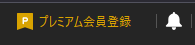
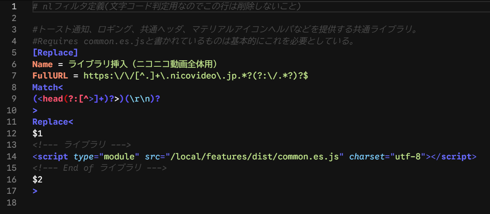

# Usage Guide

> Author: ◆awd5z.AlOFJq (roflsunriz)
> Last updated: 2026-02-22

## Table of Contents

- [Table of Contents](#table-of-contents)
- [1. Installation](#1-installation)
  - [標準手順](#標準手順)
  - [クリーンインストール手順](#クリーンインストール手順)
  - [参考資料](#参考資料)
  - [1.1 Symlink Setup (Required)](#11-symlink-setup-required)
- [2. Filter Descriptions](#2-filter-descriptions)
  - [100\_common.txt](#100_commontxt)
  - [101\_disable\_official\_function.txt](#101_disable_official_functiontxt)
  - [102\_mlink\_video\_controller.txt](#102_mlink_video_controllertxt)
  - [103\_comment\_filter2.txt](#103_comment_filter2txt)
  - [104\_video\_player.txt](#104_video_playertxt)
  - [105\_premium\_hide.txt](#105_premium_hidetxt)
  - [106\_watch\_history.txt](#106_watch_historytxt)
- [3. Enabling/Disabling Filters](#3-enablingdisabling-filters)
- [4. Watch Page Background Image Settings](#4-watch-page-background-image-settings)
- [5. Important: Data Deletion Warning](#5-important-data-deletion-warning)
  - [ブラウザデータ削除時の注意](#ブラウザデータ削除時の注意)
  - [各機能のエクスポート方法](#各機能のエクスポート方法)
- [6. License](#6-license)
- [7. Related Links](#7-related-links)
  - [開発ツール](#開発ツール)
  - [コミュニティ](#コミュニティ)
  - [開発資料](#開発資料)
  - [拡張機能](#拡張機能)

---

## 1. Installation

GitHubページのリリースページ(<https://github.com/roflsunriz/filter-matome/releases>)からダウンロードしてください。

**注意事項：**

- ディレクトリ構造を壊さずにそのまま`local`フォルダは`local`フォルダに、`nlFilters`は`nlFilters`フォルダに、`extensions`フォルダは`extensions`フォルダに上書きする。
- **フィルタの抜き差しは上級者向けなのでnlFiltersの文法を完全に理解し、HTML/CSS/JavaScriptの知識が十分にあり、デベロッパーコンソールを十全に扱え、自己解決できる者だけが自己の責任で対応すること。**

問題を発見した場合は[GitHubのIssue](https://github.com/roflsunriz/filter-matome/issues)にて報告してください。あるいはIssueで相談してからPull Requestを送ってください。

### 標準手順

1. 新しいバージョンのファイルをnlFilters,extensionsに上書きコピー
2. `local/background-images,local/features,loca/images`フォルダ、mime.typesファイルを上書き更新

### クリーンインストール手順

`nlFilters`から100*〜199*.txtを削除後、ダウンロード済みパッケージの構成とNicoCache_nlのファイル構成を比べて必要なファイルのみを残したあと標準手順を実行する。

### 参考資料

- [拡張機能のインストールガイド](https://w.atwiki.jp/nicocachenlwiki/pages/21.html)
- [拡張機能のアップデート手順](https://w.atwiki.jp/nicocachenlwiki/pages/25.html)

---

### 1.1 Symlink Setup (Required)

NicoCache_nl はキャッシュデータ用スクリプトを `C:\NicoCache_nl\local\list.js` の固定パス・固定名で参照します。

ビルド成果物（例: `cache-data-manager.iife.js`）へこの固定パス名で**シンボリックリンクを作成**しないと機能しません。

**要約（Windows / PowerShell）※管理者権限が必要です**

```powershell
# 既存の list.js / list.js.map を削除
Remove-Item -Path "C:\NicoCache_nl\local\list.js"
Remove-Item -Path "C:\NicoCache_nl\local\list.js.map"

# ビルド成果物へリンクを作成
New-Item -ItemType SymbolicLink -Path "C:\NicoCache_nl\local\list.js" -Target "C:\NicoCache_nl\local\features\dist\cache-data-manager.iife.js"
New-Item -ItemType SymbolicLink -Path "C:\NicoCache_nl\local\list.js.map" -Target "C:\NicoCache_nl\local\features\dist\cache-data-manager.iife.js.map"
```

詳細な手順は [creating-symlink-for-listjs.md](creating-symlink-for-listjs.md) を参照してください。

---

## 2. Filter Descriptions

**注意事項：**

- 毎回リリースノートを確認してください。
- 各 nlFilter は`<link rel="...">`や`<script src="...">`で`./local/features/*`から呼び出す形になっているものが多いため、ファイルの更新日が変わっていないことがあることに注意してください。更新による差分を見たいときは[WinMerge](https://winmerge.org/?lang=ja)が便利です。
- また、nlFilters フォルダから削除された nlFilter(txt)や、local/features から削除された css,js ファイル、または中身のないファイル群は deprecated(廃止予定)又は abolition(廃止)としているため削除してください。

**免責事項：**

- 全てのフィルタは同時使用を前提に設計しているため、自分で勝手に取捨選択した結果動作しなくても動作保証外・サポート（返信）対象外とします。
- 基本的にこのフィルタは私が使用しているものをお裾分けしているという形を取っている為、**あなたが自分で変更・改変・改造した結果不具合が起きても私は一切の責任を負いません。自身の力に於いて解決**してください。困ったらクリーンインストール！
- MITライセンス(MIT license)[(日本語訳リンク)](https://licenses.opensource.jp/MIT/MIT.html)を宣言します。改変・再配布・商用利用・非商用利用等自由、但し再配布する際に私の名前(◆awd5z.AlOFJq)を明記してください。

---

### 100_common.txt

共通ライブラリ（common.css, common.es.js）をニコニコ動画全体に挿入するフィルタ。トースト通知、ロギング、マテリアルデザインアイコンなどの基盤機能を提供する。

### 101_disable_official_function.txt

公式プレイヤーの再生速度調整機能を無効化するフィルタ。これにより102_mlink_video_controller.txtの再生速度調整機能が正常に動作するようになる。非プレミアム会員で制限されている基本的な機能を提供する基盤となる。

### 102_mlink_video_controller.txt


mylist2やcomment-filter2やサムネイル動画非表示の設定画面起動、メディア情報表示、リンクなどを提供する。ビデオの再生速度変更やフレーム単位でのシーク機能、音量の微細な調整機能、トラッカー、再生・一時停止、コメント正規表現検索、動画ダウンロードリンク、コメントダウンロードリンク、キャッシュ削除リンク、movie-infoダッシュボード、その他たくさんのリンクを`/watch/`ページで提供する。

### 103_comment_filter2.txt


ニコニコ動画公式のNGワード機能が極めて貧弱なので、この機能で非常に強力なNG機能を提供する。基本的に、UIの説明通りにNGワード等を入力して保存するだけ。comment-filter2を表示させるにはmlink-video-controller内のリンクが必要。ℹ️マークを押すと説明ページに飛ぶ。またテキストフィールドのレーベルにマウスをホバーさせると詳細な情報が表示される。

### 104_video_player.txt


キャッシュ済みの有料動画（視聴期限切れ）などをコメント付きで視聴するための機能。正しいIDを動画ファイルに指定し、cacheフォルダに置くことで任意の動画に任意のコメントを被せて視聴することも可能。mlink-video-controller内のモジュールのDeletedVideoDetectorで削除済み動画を検知し、その動画をこのプレイヤーで再生する機能も有する。

再生されない場合、多くの場合タイミングが問題なのでF5かCtrl+F5(キャッシュを無視したハードリロード)で解決する。`/local/cache/` フォルダ以下に `（動画ID）.hls` フォルダまたは `（動画ID）.mp4` キャッシュを置いてもキャッシュを利用して再生する。

※mp4ファイルの動画の場合、scripts/convert-to-faststart.ps1を実行してfaststart化してください。faststartとは、mp4ファイルのmoovアトムをファイルの先頭に移動させ、ストリーミング再生に最適化するための技術です。これにより、再生が高速化されます。

> **注意**
>
> フォルダ名または動画ファイル名に動画タイトルや画質、音質、lowその他余計なものが含まれていると再生できないため必ずそれらを削除すること。

### 105_premium_hide.txt




コモンヘッダーのプレミアム会員勧誘要素を非表示にする。

### 106_watch_history.txt


視聴履歴のページを追加し([こちら](https://www.nicovideo.jp/local/features/dist/src/watch-history/index.html))、視聴ログを表示するようにした。ブラウザの容量が許す限り履歴を保存するようにした。統計も利用可能。

---

- 詳細なcomment-filter2の説明は[こちら](https://www.nicovideo.jp/local/features/dist/src/docs/comment-filter2/index.html)を参照。
- 詳細なmylist2の説明は[こちら](https://www.nicovideo.jp/local/features/dist/src/docs/mylist2/index.html)を参照。

---

## 3. Enabling/Disabling Filters

[nlFilter の文法](https://w.atwiki.jp/nicocachenlwiki/pages/17.html)を参照

必要に応じてコメントアウトされているフィルタを有効にしたり、無効にしたりする。有効化されている状態とは、[Replace]/[Script]/[Style]/[Request]と書かれている状態で、無効化されている状態とは、そのカギカッコの前に半角シャープ記号を書き足した状況、つまり#[Replace]#[Script]#[Style]#[Request]のような状態のことである。

**使用例：**

| 無効状態 | 有効状態 |
|---------|---------|
| `#[Replace]` | `[Replace]` |

nlFiltersのシンタックスハイライト機能は[NLF Code](https://github.com/roflsunriz/NLF-Code)が利用可能。



---

## 4. Watch Page Background Image Settings


[CSS: カスケーディングスタイルシート:MDN](https://developer.mozilla.org/ja/docs/Web/CSS)を参照

背景画像を変更したい場合は、画像を[Squoosh](https://squoosh.app/)等で好きな画像形式に変換し(ブラウザが解釈できる形式であれば変換する必要はない)、Nicocache_nlの`local/background-images/favorites`等任意のフォルダに画像をコピペする。(NicoCache_nlからファイルを参照するには`local`フォルダ以下でなければならない。)mlink-video-controllerの設定タブ、背景画像設定から背景画像を設定できる。URL指定とファイル選択ができ、ファイル選択したときはIndexedDBにbase64エンコードデータとして保存される。URL指定は`https://www.nicovideo.jp/local/background-images/microsoft/background1.avif`のように指定する。`local`フォルダの`hoge`フォルダにimage.jpgがあれば`https://www.nicovideo.jp/local/hoge/image.jpg`と指定する。外部Webサイトのパス(https://www.nicovideo.jp/local/ 以外のパス)も指定可能だが、読み込み時サーバーに負荷がかかる恐れがあるので非推奨。円環が大きくなり過ぎない範囲で任意の数指定可能。もちろんフォルダーパスも自由。

**注意事項（nico_wallpaperG併用時）：**

nico_wallpaperGと併用している場合衝突が起きるのでそのときは、どちらを優先するかによるがmlink-video-controllerにて背景セレクターとマトリックス背景を無効化し、「wp1.css」に以下を追記する。（デフォルトの場合）

```css
:root {
  --bg-img: url('https://www.nicovideo.jp/local/nico_wallpaperG/wp1.jpg') repeat center fixed !important;
}
```

---

## 5. Important: Data Deletion Warning

### ブラウザデータ削除時の注意

以下の操作を行うと設定データが消去されます：

- サイトデータの削除
- オフライン作業用データの削除
- Cookieと他のサイトデータの削除
- Cookieとサイトデータの削除
- …等の表記がある閲覧履歴データの削除

**削除されてしまう設定：**

- mlink-video-controller（IndexedDBに保存された背景画像の設定全般）
- mylist2（IndexedDBに保存されたマイリストのデータ全般）
- comment-filter2（IndexedDBに保存されたNGコメントの設定全般）
- その他「ローカルストレージ」に保存されている音量、再生速度設定等

**事前対策：**

1. 各機能の設定画面から「エクスポート」を実行
2. エクスポートファイルを安全な場所に保存
3. データ削除後に「インポート」で復元

保存されている各データはWebサイトにフォーカスがある状態でF12キーを押すと開発者ツールが開き、「ストレージ」タブや「アプリケーション」タブで確認できます。

### 各機能のエクスポート方法

**mylist2**

<https://www.nicovideo.jp/local/features/dist/src/mylist2/index.html> にアクセスし、「エクスポート」ボタンをクリック

**comment-filter2**

ニコニコ動画の視聴ページに行き、コメントフィルタ設定画面の「エクスポート」ボタンをクリック

---

## 6. License

<details>
<summary>ライセンス条文（クリックで展開）</summary>

The MIT License

Copyright (c) 2017-2025 ◆awd5z.AlOFJq

本ソフトウェアおよび関連する文書のファイル（以下「ソフトウェア」）の複製を取得した全ての人物に対し、以下の条件に従うことを前提に、ソフトウェアを無制限に扱うことを無償で許可します。これには、ソフトウェアの複製を使用、複製、改変、結合、公開、頒布、再許諾、および/または販売する権利、およびソフトウェアを提供する人物に同様の行為を許可する権利が含まれますが、これらに限定されません。

上記の著作権表示および本許諾表示を、ソフトウェアの全ての複製または実質的な部分に記載するものとします。

ソフトウェアは「現状有姿」で提供され、商品性、特定目的への適合性、および権利の非侵害性に関する保証を含むがこれらに限定されず、明示的であるか黙示的であるかを問わず、いかなる種類の保証も行われません。著作者または著作権者は、契約、不法行為、またはその他の行為であるかを問わず、ソフトウェアまたはソフトウェアの使用もしくはその他に取り扱いに起因または関連して生じるいかなる請求、損害賠償、その他の責任について、一切の責任を負いません。

---

The MIT License

Copyright 2017-2025 ◆awd5z.AlOFJq

Permission is hereby granted, free of charge, to any person obtaining a copy of this software and associated documentation files (the "Software"), to deal in the Software without restriction, including without limitation the rights to use, copy, modify, merge, publish, distribute, sublicense, and/or sell copies of the Software, and to permit persons to whom the Software is furnished to do so, subject to the following conditions:

The above copyright notice and this permission notice shall be included in all copies or substantial portions of the Software.

THE SOFTWARE IS PROVIDED "AS IS", WITHOUT WARRANTY OF ANY KIND, EXPRESS OR IMPLIED, INCLUDING BUT NOT LIMITED TO THE WARRANTIES OF MERCHANTABILITY, FITNESS FOR A PARTICULAR PURPOSE AND NONINFRINGEMENT. IN NO EVENT SHALL THE AUTHORS OR COPYRIGHT HOLDERS BE LIABLE FOR ANY CLAIM, DAMAGES OR OTHER LIABILITY, WHETHER IN AN ACTION OF CONTRACT, TORT OR OTHERWISE, ARISING FROM, OUT OF OR IN CONNECTION WITH THE SOFTWARE OR THE USE OR OTHER DEALINGS IN THE SOFTWARE.

法的に有効なのは英語版のライセンス条文のみです。詳細は[MITライセンス（日本語訳）](https://licenses.opensource.jp/MIT/MIT.html)と[MITライセンス（英語原文）](https://opensource.org/license/mit)を参照してください。

</details>

---

## 7. Related Links

### 開発ツール

- [Apache Ant (Javaビルドツール)](https://ant.apache.org/bindownload.cgi)
- [Adoptium OpenJDK (Java Development Kit)](https://adoptium.net/temurin/releases/?version=17&os=windows&package=jdk&arch=x64)
- [BouncyCastle (暗号化ライブラリ)](https://www.bouncycastle.org/latest_releases.html)
- [MediaInfo (メディア情報表示)](https://mediaarea.net/en/MediaInfo/Download/Windows)
- [WinMerge (ファイル差分比較)](https://winmerge.org/?lang=ja)

### コミュニティ

- [5ちゃんねる 本スレッド](https://find.5ch.net/search?q=NicoCache)
- [おーぷん2ちゃんねる スレッド](https://ana.open2ch.net/test/read.cgi/software/1675001508/)
- [Talkスレッド](https://talk.jp/boards/software/1675038388)
- [開発スレッド](https://sportschan.org/librejp/thread/16592.html)
- [NicoCache_nl Wiki](https://w.atwiki.jp/nicocachenlwiki/pages/1.html)
- [ファイル置き場 避難所3](https://nicocache.jpn.org/)

### 開発資料

- [MDN Web Docs](https://developer.mozilla.org/ja/)
- [HTML早見表](https://developer.mozilla.org/ja/docs/Learn/HTML/Cheatsheet)
- [正規表現早見表](https://developer.mozilla.org/ja/docs/Web/JavaScript/Guide/Regular_expressions/Cheatsheet)
- [正規表現テストツール](https://rubular.com/)
- [Markdown基本文法](https://www.markdownguide.org/basic-syntax/)

### 拡張機能

- [d-anime-nico-comment-renderer : dアニメでニコニコ動画のコメントをレンダリングするユーザースクリプト](https://github.com/roflsunriz/web-page-enhancement-scripts)
