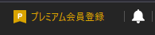
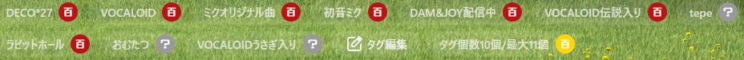
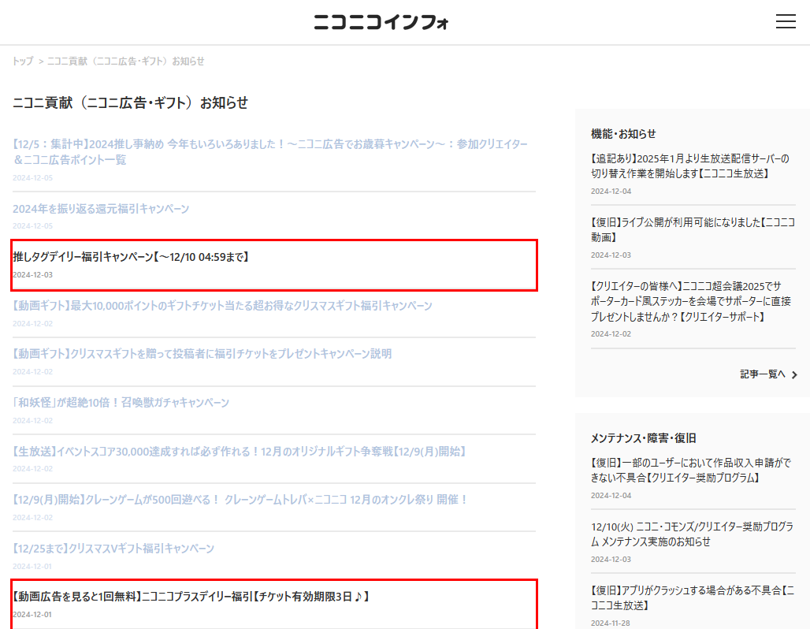
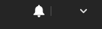
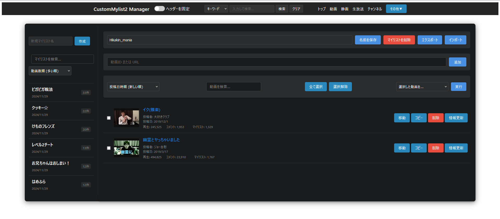
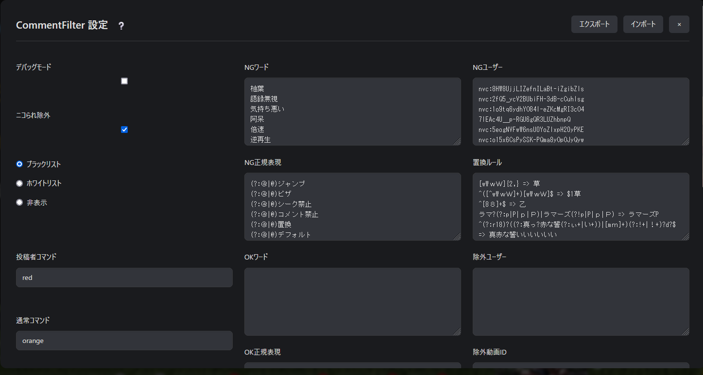
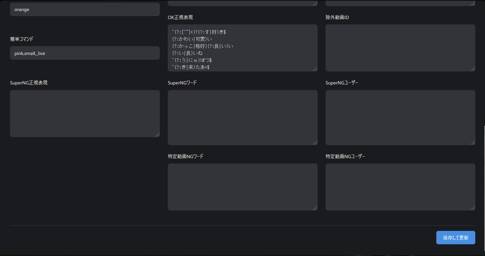
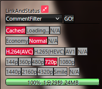

# カスタムフィルターの使い方説明

作者：◆awd5z.AlOFJq  
更新日：2024 年 12 月 06 日

<link rel="Shortcut Icon" href="./resources/nico.ico" type="image/x-icon" />

> **_注意！_**  
> **_毎回リリースノートを確認してください。_**      
> **_各 nlFilter は_**<p style="color:#BB8B38;display:inline">`<link rel="...">`</p>**_や_**<p style="color:#BB8B38;display:inline">`<script src="...">`</p>**_で_**<p style="color:#BB8B38;display:inline">`./local/CustomFilters/*`</p>**_から呼び出す形になっているものが多いため、ファイルの更新日が変わっていないことがあることに注意してください！ 更新による差分を見たいときは_**[WinMerge](https://winmerge.org/?lang=ja)**_が便利です。_**  
> **_また、nlFilters フォルダから削除された nlFilter(txt)や、local/CustomFilters から削除された css,js ファイル、または中身のないファイル群は deprecated(廃止予定)又は abolition(廃止)にしているため削除してください。_**

> **_免責事項_**  
> **_<p style="color:red;display:inline">全てのフィルタは同時使用を前提に設計しているため、自分で勝手に取捨選択した結果動作しなくても動作保証外・サポート（返信）対象外</p>とします。_**  
> **_基本的にこのフィルタは私が使用しているものをお裾分けしているという形を取っている為、<p style="color:red;display:inline">あなたが自分で変更・改変・改造した結果不具合が起きても私は一切の責任を負いません。自身の力に於いて解決</p>してください。困ったら<p style="color:lightgreen;display:inline">クリーンインストール！</p>_**  
> **_[アンライセンス・ライセンス(unlicense license)](https://ja.wikipedia.org/wiki/Unlicense)を宣言します。[パブリックドメインの CC0](https://creativecommons.jp/sciencecommons/aboutcc0/)と同等です。改変・再配布・商用利用・非商用利用等自由、但し NicoCache_nl の公式アップローダ以外で配布する場合私の名前を明記してくれると嬉しいです。_**

<details><summary>Unlicense License 条文</summary><div>
<p style="text-align:center;">Unlicense License</p>
<p>This is free and unencumbered software released into the public domain.</p>
<p></p>
<p>Anyone is free to copy, modify, publish, use, compile, sell, or</p>
<p>distribute this software, either in source code form or as a compiled</p>
<p>binary, for any purpose, commercial or non-commercial, and by any</p>
<p>means.</p>
<p></p>
<p>In jurisdictions that recognize copyright laws, the author or authors</p>
<p>of this software dedicate any and all copyright interest in the</p>
<p>software to the public domain. We make this dedication for the benefit</p>
<p>of the public at large and to the detriment of our heirs and</p>
<p>successors. We intend this dedication to be an overt act of</p>
<p>relinquishment in perpetuity of all present and future rights to this</p>
<p>software under copyright law.</p>
<p></p>
<p>THE SOFTWARE IS PROVIDED "AS IS", WITHOUT WARRANTY OF ANY KIND,</p>
<p>EXPRESS OR IMPLIED, INCLUDING BUT NOT LIMITED TO THE WARRANTIES OF</p>
<p>MERCHANTABILITY, FITNESS FOR A PARTICULAR PURPOSE AND NONINFRINGEMENT.</p>
<p>IN NO EVENT SHALL THE AUTHORS BE LIABLE FOR ANY CLAIM, DAMAGES OR</p>
<p>OTHER LIABILITY, WHETHER IN AN ACTION OF CONTRACT, TORT OR OTHERWISE,</p>
<p>ARISING FROM, OUT OF OR IN CONNECTION WITH THE SOFTWARE OR THE USE OR</p>
<p>OTHER DEALINGS IN THE SOFTWARE.</p>
<p></p>
<p>For more information, please refer to <a href="https://unlicense.org/">Unlicense.org</a></p>
</div></details>

<details><summary>CC0 1.0 全世界 条文</summary><div>
<p style="text-align:center;">CC0 1.0 全世界</p>
<p> </p>
<p> クリエイティブ・コモンズは法律事務所ではなく、法律業務を提供するものではありません。 この文書の配布は、法律家と依頼者の関係性を形成するものではありません。クリエイティブ・コモンズは、この情報を現状有姿の状態で提供します。 クリエイティブ・コモンズは、この文書の利用、もしくはこの文書の下に提供される情報又は作品に関し、いかなる保証も行わず、この文書もしくはこの文書の下に提供される情報又は作品の利用の結果生じた損害に関するいかなる責任も負いません。</p>
<p> 目的の説明</p>
<p> </p>
<p> 世界の大部分の法域の法律は、新規の著作物および（または）データベース（以下、それぞれを「作品」という。）の創作者およびその承継人（以下、あわせて「権利者」という。）に対して、独占的な著作権および関連する権利（定義は後述する。）を自動的に与えている。</p>
<p> </p>
<p> 権利者の中には、創作的、文化的、科学的作品の共有地（以下「コモンズ」という。）に貢献する目的で、作品についての自己の権利を恒久的に放棄することを望む者がいる。コモンズでは、一般の人々が、確実に、かつ後発的な侵害の主張をおそれることなく、そのような作品をベースに使い、改変し、他の作品に取り込み、再利用し、再配布することができる。これらの行為は、どのような態様によっても、商業目的を含むどのような目的でも、可能な限り自由に行うことができる。</p>
<p> </p>
<p> このような権利者は、フリー・カルチャーの理念を普及させ、創造的、文化的、科学的作品のさらなる創造を促すことでコモンズへ貢献することができる。あるいはまた、他人による利用や他人の活動を通じて、自己の作品の評価の獲得や、自己の作品のさらなる流通を実現するために、コモンズへ貢献することができる。</p>
<p> 上記ならびに（または）その他の目的および動機のために、作品にCC0を付する者（以下「確約者」という。）は、追加の対価または補償を一切求めることなく、確約者が本作品の著作権および関連する権利の権利者である限り、すすんで本作品にCC0を適用し、CC0の規程に従って、自らの作品を公に配布する。この行為は、確約者が、本作品について確約者が所有している著作権および関連する権利、CC0の意味、およびCC0がこれらの権利に及ぼす法的効果を理解したうえで行われる。</p>
<p> </p>
<p> A Work made available under CC0 may be protected by copyright and related or neighboring rights ("Copyright and Related Rights"). Copyright and Related Rights include, but are not limited to, the following:</p>
<p> </p>
<ol>
<li>作品を複製し、改変・翻案し、配布し、上演・演奏し、展示し、提供し、および翻訳する権利</li>
<li>著作者および（または）実演家が保有する人格的権利</li>
<li>作品中に表現される人物の画像または肖像に関するパブリシティ権およびプライバシー権</li>
<li>作品に関連して行われる不正競争を防止する権利（ただし、4(a)に基づく制限の対象となる）</li>
<li>作品に含まれるデータを抽出し、拡布し、利用し、および再利用する権利</li>
<li>データベースの権利（たとえば「データベースの法的保護に関する指令」（1996年3月11日の、欧州議会および欧州委員会による、96/9/EC指令）、およびその指令のあらゆる国レベルでの履行により生じる権利をいい、そのような指令のあらゆる改正版および後継版により生じる権利を含むものとする。）、および、</li>
<li>その他、世界中で、適用される法令または条約、および、それらのあらゆる国内履行に基づいて生じる、上記各権利に類似し、同等の、または対応する権利。</li>
</ol>
<p> </p>
<ol>
<li>著作権および関連する権利</li>
<p> </p>
<p> CC0の下で利用可能とされる作品は、著作権、および関連しまたは隣接する権利（本規程において「著作権および関連する権利」という。）によって保護されている場合がある。著作権および関連する権利には以下に掲げるものを含むが、これに限られない。</p>
<li>権利放棄</li>
<p> </p>
<p> 確約者は、適用される法令に基づいて許容され、かつこれに反しない最大限の範囲で、明示的に、完全に、恒久的に、取消不能および無条件の形で、現に知られているか否かにかかわらず、確約者の本作品の著作権および関連する権利、ならびに関連する請求および請求原因（現在および将来の請求および請求原因を含む。）を放棄し、または主張しない（以下、あわせて「権利放棄」という。）。その権利放棄は、(1)世界中のあらゆる地域で、(2)適用される法令または条約により与えられる最大限の期間（将来の期間延長を含む。）について、(3)現在または将来のあらゆる媒体について、かつ複製回数を問わず、(4)商用、広告、または宣伝目的を含むあらゆる利用目的について行うものとする。確約者は、公衆に属するあらゆる者の利益のために、確約者の相続人および承継人に不利益が及ぶ形であっても、権利放棄を行う。この権利放棄は、「目的の説明」において述べたような公衆による本作品の平穏な享受を害するような撤回、取消、解約、解除その他実体法上または衡平法上の訴えの対象としないことをまさに意図して行うものである。</p>
<li> パブリックライセンスによる補完 権利放棄のいずれかの部分について、その理由の如何にかかわらず、適用される法令の下で無効であり、または効力が生じないものと司法上の判断がされたときは、権利放棄の効果は、確約者による「目的の説明」の表明内容を考慮して許容される最大限の範囲で維持される。さらに、確約者は、無効・不効力により影響を受ける人に対し、権利放棄が前記のとおり判断された範囲内において、無償、譲渡不可、再許諾不可、非独占、取消不能および無条件の形で、確約者が本作品について有する著作権および関連する権利の利用を許諾する（以下「利用許諾」という。）。この利用許諾は、(1)世界中のすべての地域で、(2)適用される法令または条約により与えられる最大限の期間（将来の期間延長を含む。）について、(3)現在または将来のあらゆる媒体について、かつ複製回数を問わず、(4)商用、広告、または宣伝目的を含むあらゆる利用目的について行うものとする。その利用許諾は、確約者によって作品にCC0が適用された日から効力が生じたものとみなす。利用許諾のいずれかの部分について、その理由の如何にかかわらず、適用される法令上無効であり、または効力が生じないものと司法上の判断がされたときは、その部分的な無効または効力の不存在は、それ以外の利用許諾を無効化しない。かかる場合において確約者は、(1)本作品についての手元にある著作権および関連する権利を行使しないこと、または(2)本作品に関連するあらゆる請求をせず、および請求原因を主張しないものとし、いずれの場合も確約者が明示的に述べられた「目的の説明」に反する行為をしないことを確約する。</li>
</ol>
<ol type="a">
<li>確約者が有する一切の商標権または特許権は、この文書によっては放棄されず、他人に譲渡されず、委任されず、または許諾されず、その他の影響を受けることもない。</li>
<li>確約者は本作品を現状のまま提供し、明示であるか黙示であるかを問わず、法令の定めその他の根拠の如何にかかわらず、本作品に関するいかなる表明も保証も提供しない。提供しない表明や保証には、権原の存在、商品性、特定の利用目的への適合性、権利侵害または潜在的な瑕疵その他の欠陥の不存在、正確性、誤りの有無についての表明や保証が含まれるが、これらに限られないものとし、発見可能性の有無を問わず、いずれも適用される法令の下で認められる最大限の範囲とする。</li>
<li>確約者は、本作品、または本作品のあらゆる利用に関連して適用される、他人のすべての権利（あらゆる者の著作権および関連する権利を含み、かつこれに限られない。）について、その処理を行う責任を負わない。さらに確約者は、どのようなものであれ本作品の何らかの態様による利用のために必要な同意、許諾、またはその他の権利を取得する責任を負わない。</li>
<li>確約者は、クリエイティブ・コモンズが本文書の当事者ではなく、このCC0または本作品の利用に関連するいかなる義務または責任を負わないことを理解し、同意する。</li>
</ol>
<a href="https://creativecommons.org/publicdomain/zero/1.0/legalcode.ja">Creative Commons Public Domain CC0</a>
</div></details>

##### コンテンツ

- [1.導入方法](#1導入方法)
- [2.各フィルタについての説明](#2各フィルタについての説明)
- [3.その他、フィルタの有効/無効切り替え方法など](#3その他フィルタの有効無効切り替え方法など)
- [4.watchページ整形フィルタの背景画像の取扱](#4watchページ整形フィルタの背景画像の取扱)
- [5.CustomMylist2について](#5custommylist2について)
- [6.CommentFilter について](#6commentfilter-について)
- [Z.リンク](#zリンク)
- [Z2.おすすめフリーソフト・Windows](#z2おすすめフリーソフトwindows)
- [Z3 おすすめフリーソフト・Android・WSA で Windows でも使用可能](#z3-おすすめフリーソフトandroidwsa-で-windows-でも使用可能)
- [Z4 リリースノートについて](#z4-リリースノートについて)
  - [リリースノートは198\_ReleaseNotes.md(.html)に移行されました。](#リリースノートは198_releasenotesmdhtmlに移行されました)

導入例


## 1.導入方法

- [x] 詳しい情報は[拡張機能のインストール](https://w.atwiki.jp/nicocachenlwiki/pages/21.html)を参照
- [x] 詳しい情報は[拡張機能のアップデート](https://w.atwiki.jp/nicocachenlwiki/pages/25.html)を参照  
       ディレクトリ構造を壊さずにそのまま`local`フォルダは`local`フォルダに,`nlFilters`は`nlFilters`フォルダに上書きする。入れたくないフィルタがある場合であっても全フィルタの同時使用を前提に設計している為そのまま我慢して使用してほしい。<p style="color:red;display:inline">フィルタの抜き差しは上級者向けなのでnlFiltersの文法を完全に理解し、HTML,CSS,Javascriptの知識が十分にあり、デベロッパーコンソールを十全に扱え、自己解決できる者だけが自己の責任で対応</p>すること。<p style="color:red;display:inline">自分自身で勝手に取捨選択した結果動作しなくてもそれはサポート対象外でありこのフィルタまとめを使用した時点で「自分で改造した結果動作しなくてもサポートを放棄する」これに同意したものと見做す。未改造であるならこの限りでは無い。</p>私は<p style="color:red;display:inline">基本的に全てのフィルターをデフォルト状態で運用することを前提に設計している為、個々のフィルターだけで運用出来るかは不明であり、将来的に個々のフィルターで運用できるかどうか試すことも無い事をここに明記する。</p>アップデート時は基本的には上書きインストールで大丈夫なことが多いが、ときどき廃止したファイルはアップデートファイルの中から削除していたり、上書きインストール前提で同名ファイルの中身を空にしていたりすることがあるので「クリーンインストールしたほうが良い」という注意書きがあればそれに従うこと。一番確実な方法は、一旦<p style="color:lightgreen;display:inline">`nlFilters`から 100*~199*.txt を削除し、`test_nlFilters`のダウンロードファイルに倣って`local`の中身を空にした上でアップデートファイルをコピー</p>すればよい(便宜上これを<p style="color:lightgreen;display:inline">クリーンインストール</p>と呼ぶ)。

## 2.各フィルタについての説明

<p style="color:red;display:inline">当然だが以下のフィルタはほとんどすべて/local/以下から呼び出す形になっている為nlFilter単体では動作せず、/local/のファイル群もインストールが必要になる。</p>※もし助けが必要な場合には、又は特殊なインストール手順が必要なものについては各テキストファイル/css/js内部に方法がコメントとして書かれている場合もあるのでよく読んでからスレッドに書き込みすること。  
  
- **100_Library.txt**  
common.js(/CustomCommon/common.js)とJQuery等を*.nicovideo.jp/*に挿入するフィルタ。common.jsはほとんどのフィルターで必須ファイルとなっている。
  
- **101_PremiumRecruitHide.txt**  
<table>
<tr>
<td></td>
<td></td>
</tr>
</table>
コモンヘッダーに表示されているプレミアム会員の勧誘を非表示にする。 
       
- **102_WatchPageMisc.txt**  

```/watch/```以下で動作するフィルタで、現在背景を変更する機能とタグカウンター機能の提供のみ。
  
- **103_WatchPageMiscBackground.txt**  
<table>
<tr>
<td></td>
<td></td>
</tr>
</table>
```104_WatchReconstruct.txt```と協調動作するフィルタで、背景画像用。  
MatrixRainを使用したい場合は、watch:matrixを有効化して、watch:背景画像指定を無効化する。

- **104_WatchPageDebug.txt**  
  デバッグ用
  
- **105_NicoAdsTickets.txt**  

  ニコニコインフォでの、無料で取得可能そうなニコニ広告用チケットリンクを強調表示するフィルタ。

- **106_CommonHeaderIconHide.txt**  

  スクリーンショットやデスクトップキャプチャに備えて、ユーザー名を非表示にするフィルタ。

- **107_RankingFilter.txt**  

  ランキングにフェッチリンクを追加するフィルタと不快な動画を非表示にするフィルタ。

- **108_SearchResultMultiColumnist.txt**  

  タグ検索(tag)、キーワード検索(search)、新着動画(newarrival)、新着コメント(recent)ページで動画を 8 列表示。

- **109_CustomMylist2Filter.txt**  

  カスタムマイリスト機能を追加するフィルタ。```https://www.nicovideo.jp/local/CustomMylist2/html/manager.html```でアクセス可能。

- **110_CommentFilter.txt** 

 
  基本的に、UIの説明通りにNGワード等を入力して保存するだけ。CommentFilterを表示させるにはLinkAndStatusのリンクが必要。?マークを押すと説明ページに飛ぶ。またテキストフィールドの上の項目名にマウスをホバーさせると詳細な情報が表示される。


- **111_PlaybackrateChanger2.txt**  
<table>
<tr>
<td></td>
<td></td>
</tr>
</table>
  `/watch/`以下で動作するフィルタで、ビデオの再生速度変更やフレーム単位でのシーク機能、音量の微細な調整機能、トラッカー、再生・一時停止、コメント正規表現検索など多彩な機能を提供する。導入直後は Ctrl+F5 でのハードリロード（キャッシュを無効化した更新）が必須となる。

- **112_VideoUseForNeedPayments.txt**  

有料で購入したアニメや映画、特撮などの動画をNicoCache_nl/cacheフォルダ（デフォルトの場合）に既にキャッシュとして保存している場合、有効期限が切れてもこれがあれば視聴可能となる。<p style="color:red;display:inline">操作欄は使用不能になるためPlaybackrateChanger2は必須になる。</p> 再生されない場合、多くの場合タイミングが問題なのでF5かCtrl+F5(キャッシュを無視したハードリロード)で解決する。 ````112_VideoUseForNeedPayments.txt```` の本体は ```needPaymentsVideo.js``` である。 ```/local/CustomCache/``` フォルダ以下に ```（動画ID）.hls``` フォルダまたは ```（動画ID）.mp4``` キャッシュを置いてもキャッシュを利用して再生する。<p style="color:red;display:inline">※※※注意※※※ フォルダ名または動画ファイル名に動画タイトルや画質、音質、lowその他余計なものが含まれていると再生できないため必ずそれらを削除すること。</p>

- **113_LinkAndStatus.txt**  

  動画ダウンロードリンク、コメントダウンロードリンク、キャッシュ削除リンク、キャッシュの詳細を表示する「nlMediaInfo」（最新版 nlMediaInfo が導入されている場合のみ）、その他たくさんのリンクを`/watch/`ページ以下で提供、基本的には全ページで動作する。

- **199_README.md**  
  使い方の説明。(Markdown language 版)

- **199_README.html**  
  使い方の説明。(html 版)

## 3.その他、フィルタの有効/無効切り替え方法など

- [x] 詳しい情報は[nlFilter の文法](https://w.atwiki.jp/nicocachenlwiki/pages/17.html)を参照  
       必要に応じてコメントアウトされているフィルタを有効にしたり、無効にしたりする。有効化されている状態とは、\[Replace\]/\[Script\]/\[Style\]/\[Request\]と書かれている状態で、無効化されている状態とは、そのカギカッコの前に半角シャープ記号を書き足した状況、つまり\#[Replace\]/\#[Script\]/\#[Style\]/\#[Request\]のような状態のことである。

例：  
コメントアウトされている（無効な）状態

```
#[Replace]
```


  
  
  
有効な状態
```  
[Replace]
```


    
  
## 4.watchページ整形フィルタの背景画像の取扱 

  
- [x] 詳しい情報は[CSS: カスケーディングスタイルシート:MDN](https://developer.mozilla.org/ja/docs/Web/CSS)を参照  
また、背景画像を指定したい場合は、Nicocache_nlのlocalフォルダに画像をコピペして、アドレスをNicoCache_nl\local\CustomFilters\WatchPageMiscにある「watchBackgroundRoot.css」に指定しておけばよい。デフォルトでは  
```
  https://www.nicovideo.jp/local/background.avif
```
の部分を、
```
https://www.nicovideo.jp/local/（任意のディレクトリ階層構造）/(任意の背景画像ファイル名).(ブラウザが解釈できる拡張子,jpg,jpeg,png,webp,gif,avifなど)
```
に変更すればいい。例えば
```
local/test/hoge/mywallpaper.webp
```
に画像ファイルを置いたら
```
https://www.nicovideo.jp/local/test/hoge/mywallpaper.webp
```
にする。  
  
  
  
  
※nico_wallpaperGと併用している場合衝突が起きるのでそのときは、どちらを優先するかによるが「wr_BackgroundHTML5.css」をどこかに退避させ,「wp1.css」に以下を追記する。（デフォルトの場合）  
  
```css
:root{
--bg-img:url('https://www.nicovideo.jp/local/nico_wallpaperG/wp1.jpg') repeat center fixed !important;
}
```
  
  
## 5.CustomMylist2について  
  ブラウザでや「サイトデータの削除」や「オフライン作業用データの削除」を行うとマイリストの中身も消去される可能性が高いので注意！これらを実行する前に必ずエクスポートすること。

## 6.CommentFilter について

上記 110_CommentFilter.txt の項に詳しい説明があります。同様にブラウザでや「サイトデータの削除」や「オフライン作業用データの削除」を行うと CommentFilter の設定も消去される可能性が高いので注意されたい。これらを実行する前に設定を必ずエクスポートすること。

## Z.リンク

ビルドツール

[Download Apache Ant](https://ant.apache.org/bindownload.cgi)

Java

[Download Adoptium OpenJDK](https://adoptium.net/temurin/releases/?version=17&os=windows&package=jdk&arch=x64)

暗号化・証明書関連

[BouncyCastle](https://www.bouncycastle.org/latest_releases.html)

メディア情報表示

[MediaInfo](https://mediaarea.net/en/MediaInfo/Download/Windows)

[Nicocache 5 ちゃんねる 本スレッド](https://find.5ch.net/search?q=NicoCache)

[Nicocache おーぷん 2 ちゃんねる スレッド](https://ana.open2ch.net/test/read.cgi/software/1675001508/)

[Nicocache Talk スレッド](https://talk.jp/boards/software/1675038388)

[Nicocache 開発 スレッド](https://endchan.gg/librejp/res/159672.html)

[NicoCache_nl Wiki (新)](https://w.atwiki.jp/nicocachenlwiki/pages/1.html)

[NicoCache 関連ファイル置き場 避難所 3](https://nicocache.jpn.org/)

ウェブ開発

[Mozilla Developer Network MDN Web Docs](https://developer.mozilla.org/ja/)

[正規表現構文早見表 - JavaScript | MDN](https://developer.mozilla.org/ja/docs/Web/JavaScript/Guide/Regular_expressions/Cheatsheet)

[HTML 早見表 - ウェブ開発を学ぶ | MDN](https://developer.mozilla.org/ja/docs/Learn/HTML/Cheatsheet)

[正規表現テスト - Rubular](https://rubular.com/)

マークダウン記法文法

[Markdown Basic Syntax](https://www.markdownguide.org/basic-syntax/)

ファイル差分表示

[WinMerge](https://winmerge.org/downloads/?lang=ja)

<details><summary>蛇足</summary><div>

## Z2.おすすめフリーソフト・Windows

インデックス化と検索が非常に高速な検索ソフト

[Everything](https://www.voidtools.com/downloads/)

いろいろと楽なテキスト編集・プログラミングソフト

[Visual Studio Code(VSCode)](https://code.visualstudio.com/download)

言わずと知れた高機能画像編集ソフト

[GIMP](https://www.gimp.org/downloads/)

なんとなく使っている画像ビューア

[FastStone Image Viewer](https://www.faststone.org/FSIVDownload.htm)

コーデックインストール不要の高機能メディアプレーヤー(mpv の GUI フロントエンド)

[SMPlayer](https://www.smplayer.info/ja/downloads)

Chrome と Edge の影に隠れているブラウザソフト

[Firefox](https://www.mozilla.org/ja/firefox/windows/)

VTF ファイルのエクスプローラーでのサムネイルを表示するシェル拡張機能

[VTF Shell Extensions](https://developer.valvesoftware.com/wiki/VTF_Shell_Extensions)

シングルプレイヤーゲームのトレーナー

[WeMod](https://www.wemod.com/ja)

アニメ画像系アップスケーラー

[realcugan-ncnn-vulkan](https://github.com/nihui/realcugan-ncnn-vulkan/releases)

実写系アップスケーラー

[Real-ESRGAN-GUI](https://github.com/tsukumijima/Real-ESRGAN-GUI/releases)

## Z3 おすすめフリーソフト・Android・WSA で Windows でも使用可能

5 ちゃんねる互換スレッドブラウザソフト

[ChMate](https://apkpure.com/jp/chmate/jp.co.airfront.android.a2chMate)

dat 取得

[APIMateR](https://github.com/nonnonstop/apimater/releases)

F-droid のモダンストアアプリ

[NeoStore](https://github.com/NeoApplications/Neo-Store/releases)

画像ビューア

[QuickPic Gallery Mod](https://github.com/WSTxda/QP-Gallery-Releases)

Youtube・NicoNico 等のダウンローダ

[YTDLnis](https://github.com/deniscerri/ytdlnis/releases)

Youtube・NicoNico・BiliBili 等のクライアントソフト

[PipePipe](https://github.com/InfinityLoop1308/PipePipe/releases)

音楽ストリーミングサービス

[Spotify](https://apkpure.com/jp/spotify-music-and-podcasts-for-android/com.spotify.music)

</div></details>

## Z4 リリースノートについて

### リリースノートは198_ReleaseNotes.md(.html)に移行されました。    
今後はそちらを参照してください。     

<!----------------------------------------------------------------------------------------------------------

This file with made by
Visual Studio Code
with this↓ extension

Name: Markdown All in One
Id: yzhang.markdown-all-in-one
Description: All you need to write Markdown (keyboard shortcuts, table of contents, auto preview and more)
Version: 3.3.0
Publisher: Yu Zhang
VS Marketplace Link: https://marketplace.visualstudio.com/items?itemName=yzhang.markdown-all-in-one

To Preview Markdown documents, Ctrl+Shift+V
To Use some special function, Ctrl+Shift+P
To configure extension's settings, click lego icon on left pain, find "Markdown All in One" ,then click gear icon, click "Extension Settings"...

名前: github-dark-markdown-theme
ID: designbyajay.github-dark-markdown-theme
説明: markdown theme that looks similar to github's dark mode
バージョン: 0.1.5
パブリッシャー: Ajay Ganapathy
VS Marketplace リンク: https://marketplace.visualstudio.com/items?itemName=designbyajay.github-dark-markdown-theme

"C:\Users\(UserName)\.vscode\extensions\designbyajay.github-dark-markdown-theme-0.1.5\markdown.css"
background: #0d1117;
---------------------------------------------------------------------------------------------------------->
